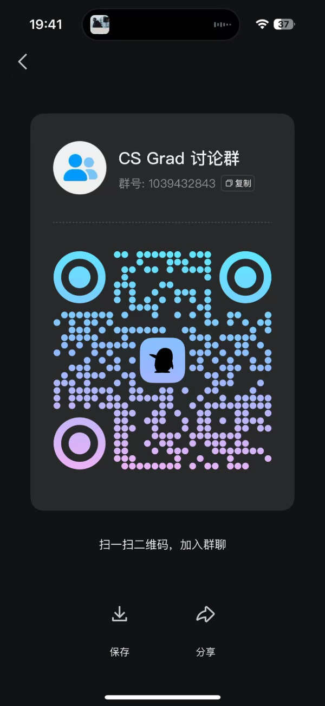

<h1 align="center">North American MSCS Application Guide</h1>

  
  

  
  

## Welcome to CS Grad

CS Grad focuses on applications to North American Master of Science in Computer Science (MSCS) programs, with introductions to related fields including computer science (CS), data science (DS), electrical engineering (EE), electrical and computer engineering (ECE), and information systems (IS). The goal is to help applicants with undergraduate degrees from **mainland China** or **North America** understand what each program offers and assess its **practical value** more efficiently. While Open CS App ranks programs primarily by their admission bar—how difficult they are to get into—CS Grad focuses on **what students gain from a program**, especially its support for finding **software development engineer (SDE) jobs in North America**, rather than admission difficulty alone.

To give applicants a fuller picture, we include **admission data points (admission DP)** and **job outcome data points (job DP)**: individual examples that illustrate admissions trends and graduates’ experiences in the job market. After all, most people pursuing an MSCS in the United States ultimately want to find a job, so employment outcomes deserve a place in application decisions.

## Website

[CS Grad English Homepage](https://csgrad.com/en/) | [Chinese Homepage](https://csgrad.com/)

## Join Discord

[Join the CS Grad Discord community](https://discord.gg/g9x4WCX2xz)

## Join Our QQ Discussion Group

QQ group number: 1039432843

## Why Apply to North American MSCS Programs?

The main reason is to find a job in the United States. The US has the world’s largest tech job market, with companies such as Google, Meta, Apple, Amazon, Netflix, Microsoft, and Nvidia, as well as hedge funds and quantitative trading firms such as Two Sigma, Citadel Securities, D. E. Shaw, and Millennium. Starting pay for new graduates (NG) in tech is around US$200,000; software engineering (SWE) roles at hedge funds start at US$350,000+, and some quantitative research (QR) roles can reach US$500,000+.

The US job market also offers better work–life balance (WLB). Some companies, such as Meta, can be demanding, but compared with ByteDance’s Dazhongsi office in Beijing—still brightly lit at 10 p.m.—the intensity is on a different scale. A common path to working in the US is therefore to pursue an MSCS, complete a summer internship, and try to convert it into a full-time offer, or apply for new-graduate roles afterward.

## How CS Grad Differs from Open CS

As noted above, Open CS ranks programs primarily by their **admission bar**, particularly for **applicants with mainland Chinese undergraduate degrees**. That does not necessarily reflect a program’s **practical value**. Some programs are more welcoming to applicants with **US undergraduate degrees** than to those with **mainland Chinese degrees**, such as Northwestern MSCS and UIUC MCS. Others have a more accessible admission bar but offer very good opportunities afterward, such as UW EE PMP. CS Grad focuses on **what a program offers in practice**, helping applicants make more informed school-selection decisions.

That is why I created CS Grad: to provide a more practical reference for applications and choosing programs.

## How We Determine Program Tiers

The program tiers were developed through discussions among the project’s early core contributors. The main factors include:

- Overall university and subject rankings.
- Program-specific employment outcomes. Some employment data and individual examples are already included in the program articles.
- Opportunities to pursue or transition into a PhD, such as Brown ScM CS for students interested in doctoral study.
- Quality of life, such as the excellent living experience at UCSD.
- Financial considerations, such as the affordability of Georgia Tech MSCS.
- Location, such as Columbia and NYU’s locations in New York City.
- Flexibility in graduation timing, such as UT ECE.
- Technical depth and rigor of the curriculum, such as the demanding, systems-focused courses in CMU MCDS and MSIN.
- Access to teaching assistant (TA) and research assistant (RA) positions for master’s students.

**Again, these tiers reflect discussions between me and several early core contributors, so some bias is inevitable. Pull requests suggesting corrections are welcome.**

## North American MSCS Application Timeline

If you are applying to MSCS programs for **Fall 2026** entry, the approximate timeline is:

## A Few Principles for Choosing CS Programs

1. You are the sum of your past experiences. No program can completely change your life; lasting change comes from your own willingness to keep growing and exploring.
2. The more important a life decision is, the less you need to follow someone else’s directions or overanalyze it. Listen patiently to your own intuition. Let instinct guide the broad direction, and use reason to work out the details.
3. A higher admission bar does not necessarily make a program a better fit for you.
4. Graduate school is a means of pursuing your aspirations, not a refuge. Life will not stand still on the day you receive an admission offer.
