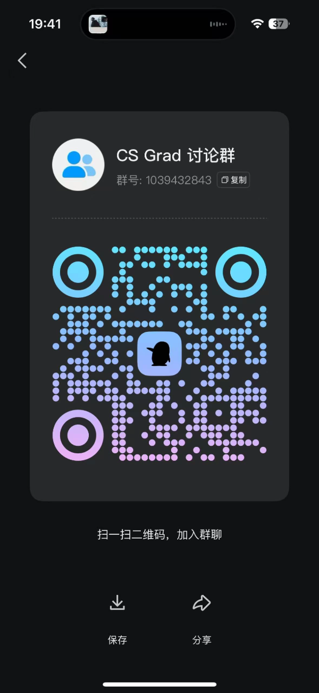

# Intro

## 欢迎来到 CS Grad 项目

CS Grad 项目专注于北美 MSCS 申请，涵盖 CS、DS、EE、ECE、IS 等相关专业的介绍。Motivation 是帮助来自 **中国大陆** 和 **北美本科** 的申请者更高效地了解各项目的定位及其 **实际价值**。与侧重录取门槛（admission bar）排名的 Open CS App 不同，CS Grad 更关注 **项目的真实价值**，尤其是在北美 **SDE求职** 方面的帮助，而 **非单纯的录取难度**。

此外，为了让申请者更全面地评估各项目，我们引入了 **录取数据点（admission DP）** 和 **求职数据点（job DP）**，以便直观展示项目的录取趋势及其在求职市场的表现。毕竟，大多数人选择前往美国攻读 MSCS，归根结底是为了找个班上，因此找工dp也是申请中不可忽视的关键因素。

## 项目网址
https://csgrad.com

## 加入QQ群讨论
qq群号：1039432843

## 为什么申请北美MSCS？
主要是为了美国找个班上，美国的tech是全世界最大的tech市场，Google、Meta、Apple、Amazon、Netflix、Microsoft、Nvidia...，hedge fund 有Two Sigma、Citadel Securities、DE Shaw、Millennium等等，其中tech ng起薪20w美金，hedge fund swe 起薪35W美金+，qr有的更是能达到50w+，

同时美国就业市场的WLB是更好的，虽然有的厂（比如Meta）是比较卷，但是和字节跳动北京大钟寺比起来（晚上十点灯火通明），还是小巫见大巫了。因此想在美国工作常见的方式
就是申请MSCS然后在这边做summer intern争取转正，或者到时候找ng

## CS Grad 与 Open CS 的区别

如前所述，Open CS 主要基于 **录取门槛** 进行排名，尤其针对 **陆本申请者**，但这未必能准确反映项目的 **实际价值**。某些项目对 **美本** 申请者较为友好，却对 **陆本** 申请者不甚友好（比如NWU MSCS和UIUC MCS）。而一些项目虽然录取门槛友好(bar低)，
但是项目的出路却非常好(比如UW EE PMP)。CS Grad 项目则重点关注 **项目的实际价值**，帮助申请者更理性地评估择校策略。

基于这一初衷，我开发了 CS Grad 项目，希望能够为大家提供更具实用性的申请和择校参考。

## 项目梯度计算方式

项目梯度是由前期的几个核心contributor讨论计算得出的，具体来说考虑的核心因素有：
院校综合排名+专业排名、专业找工数据（找工数据和dp已经部分放到了正文中）、转博/读博情况（比如brown scmcs这种适合读博向）、生活体验(比如ucsd 生活体验感拉满)、经济因素（比如gatech mscs非常经济友好）、地理位置（比如在纽约的Columbia 和NYU的地理位置就非常好）、毕业灵活性（比如UT ECE毕业灵活性非常友好）、课程硬核程度（比如CMU MCDS、MSIN的课程非常system，很硬核）、TA/RA是否对MS在读生友好等。**同时again，该项目梯度是由我和几个前期的核心
contributor讨论计算得出的，难免会有bias，欢迎大家提pr修正**

## 北美MSCS申请时间线
假如你要申请26 fall入学的MSCS项目，大致timeline如下

## CS选校之禅

1. 人是过去经历的总和, 没有什么项目能彻底改变人生，真正能改变的是不断向上、积极求索的自己
2. 越是人生中重要的选择，越不需要听从别人的指引、或者进行过量的分析，反而要耐心听取自己内心的直觉。大方向要凭本能，具体操作才要靠理性
3. 不是bar 越高的项目越适合你
4. 读研只是实现人生理想的方法，读研不是避风港，人生也不会永远静止在拿到offer的那一天

